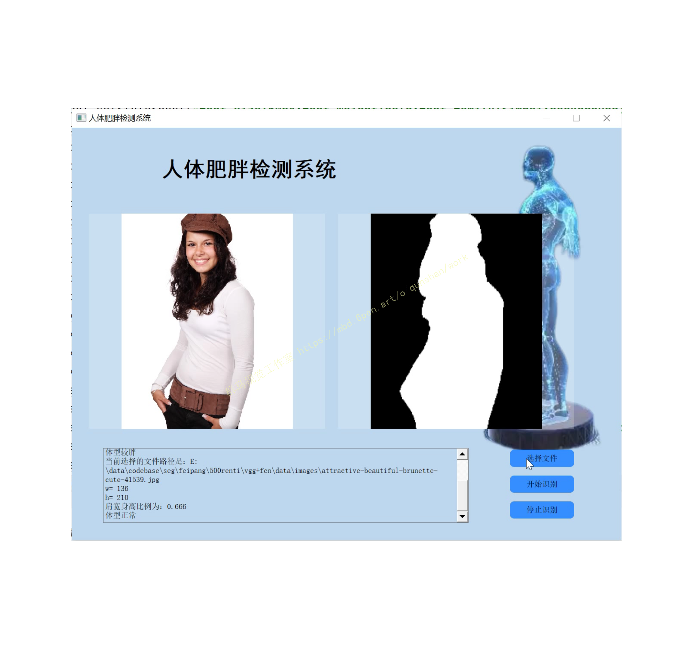
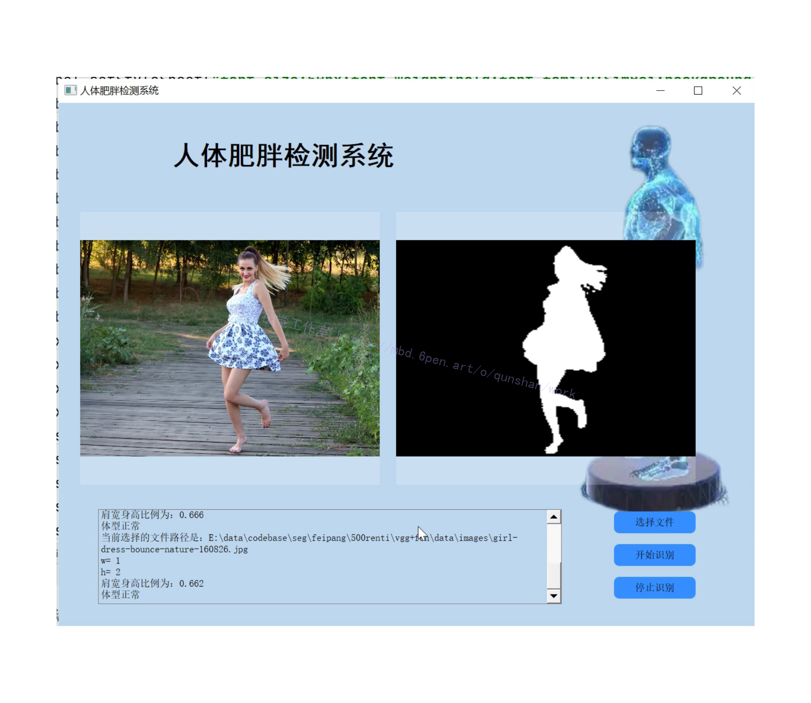
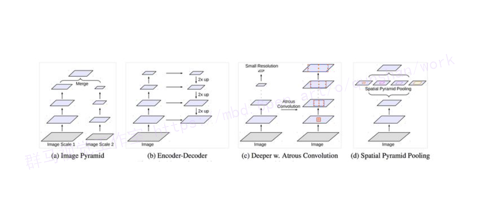
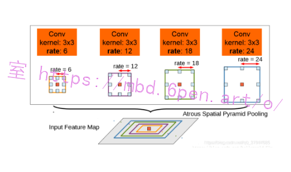
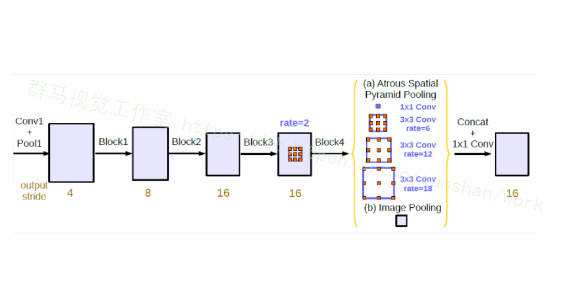
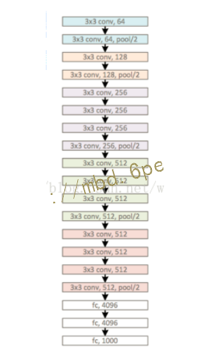
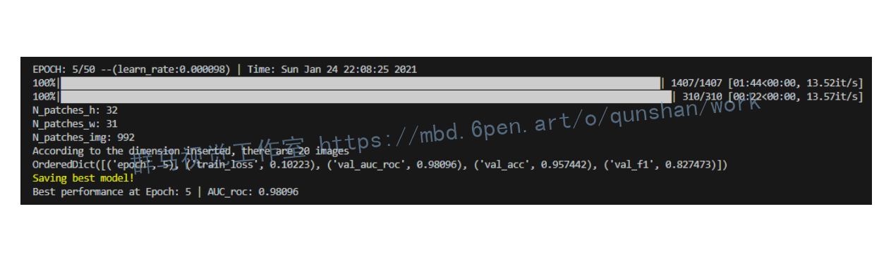
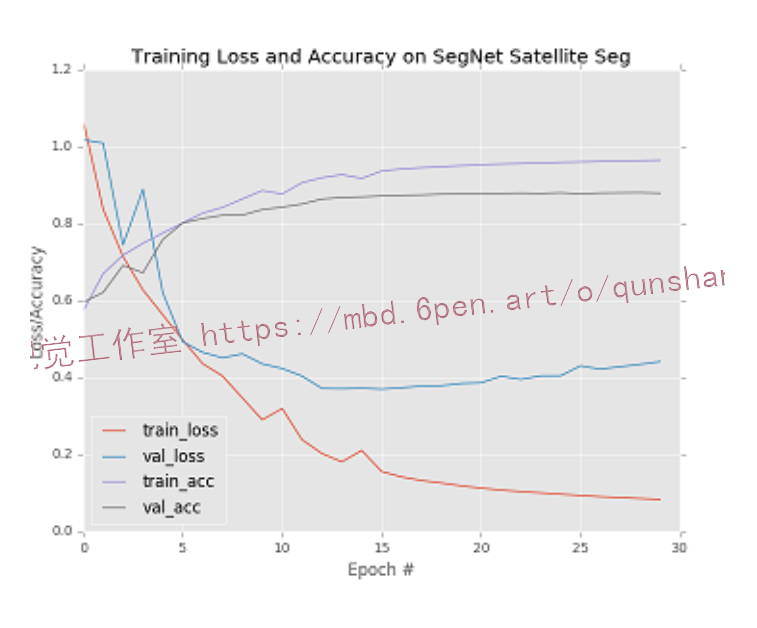
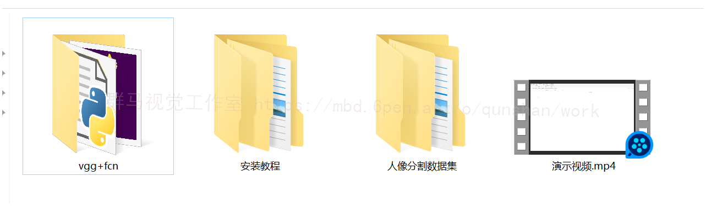

# 1.研究背景

图像分割是计算机视觉领域的基础任务也是经典难题。近年来随着深度学习的快速发展，人像分割在医疗保健领域得到了广泛的应用，通过人像分割获取人体身高体长比例，从而指导人体肥胖程度。
***
然而，现有分割方法的网络模型具有巨大的参数量和计算量，急需一种轻量化的人像精细化分割网络。　　本文通过对现有的图像分割算法、轻量化网络设计方法以及图像边缘优化算法进行研究，提出了快速自动化人像分割网络以及边缘精细化处理方法，主要工作内容和成果如下：（1）在基于编码解码结构的U-Net网络上进行改进，提出了一种快速自动化人像分割网络。为平衡网络获取语义信息和空间信息，本文在U-Net的基础上通过增加一次降采样操作，增大卷积神经网络的感受野来获得更多的语义信息。为提高网络分割效率，本文引入了深度可分离卷积，同时采用特征相加的方式取代特征堆叠，进行网络中深层特征和浅层特征的融合。最后为提高网络分割精度同时防止网络加深造成梯度消失，本文设计了一个轻量残差块结构，完成了人像的初步分割。　　（2）提出了一种人像边缘精细处理方法。在轻量化人像分割网络对人像图片进行处理后，针对分割结果边缘不够精细的问题，本文对边缘优化方法进行研究，在引导滤波算法的基础上，采用深度学习方式，通过训练得到一个针对人像分割任务的滤波器。同时针对边缘像素，本文采用边缘注意力损失函数与图像结构损失函数，进一步对分割边缘进行精细化处理。最后在EG1800、Supervise.ly以及百度数据集上验证了其有效性。　　（3）本文设计并实现了自动化人像处理系统，该系统包括界面模块、数据处理模块、算法模块和文件模块。系统操作简便，界面简洁大方。用户选择一张人像图片后可选择人像分割、人像素描和背景替换等功能来对图片进行处理。最后可将处理好的图片保存到本地。

# 2.图片效果展示




# 3.视频效果演示
[基于改进FCN＆VGG人体图像分割肥胖程度检测（源码＆教程）_哔哩哔哩_bilibili](https://www.bilibili.com/video/BV1HG411J77V/?vd_source=bc9aec86d164b67a7004b996143742dc)


# 4.人像分割数据集（5000张，文末下载）
，在处理多尺度物体分割时，采用以下几种方式来操作：（(d)为DeepLabV2的图）

然而仅仅(在一个卷积分支网络下)使用 dilated convolution 去抓取多尺度物体是一个不正统的方法。比方说，我们用一个 HDC 的方法来获取一个大（近）车辆的信息，然而对于一个小（远）车辆的信息都不再受用。假设我们再去用小 dilated convolution 的方法重新获取小车辆的信息，则这么做非常的冗余。

基于港中文和商汤组的 PSPNet 里的 Pooling module （其网络同样获得当年的SOTA结果），ASPP 则在网络 decoder 上对于不同尺度上用不同大小的 dilation rate 来抓去多尺度信息，每个尺度则为一个独立的分支，在网络最后把他合并起来再接一个卷积层输出预测 label。这样的设计则有效避免了在 encoder 上冗余的信息的获取，直接关注与物体之间之内的相关性。

deeplabv2中的aspp如上图所示，在特征顶部映射图使用了四中不同采样率的空洞卷积。这表明以不同尺度采样时有效的，在Deeolabv3中向ASPP中添加了BN层。不同采样率的空洞卷积可以有效捕获多尺度信息，但会发现随着采样率的增加，滤波器有效权重（权重有效的应用在特征区域，而不是填充0）逐渐变小。


#### 代码实现
```
class ASPP(nn.Module):
    def __init__(self, in_channel=512, depth=256):
        super(ASPP,self).__init__()
        # global average pooling : init nn.AdaptiveAvgPool2d ;also forward torch.mean(,,keep_dim=True)
        self.mean = nn.AdaptiveAvgPool2d((1, 1))
        self.conv = nn.Conv2d(in_channel, depth, 1, 1)
        # k=1 s=1 no pad
        self.atrous_block1 = nn.Conv2d(in_channel, depth, 1, 1)
        self.atrous_block6 = nn.Conv2d(in_channel, depth, 3, 1, padding=6, dilation=6)
        self.atrous_block12 = nn.Conv2d(in_channel, depth, 3, 1, padding=12, dilation=12)
        self.atrous_block18 = nn.Conv2d(in_channel, depth, 3, 1, padding=18, dilation=18)
 
        self.conv_1x1_output = nn.Conv2d(depth * 5, depth, 1, 1)
 
    def forward(self, x):
        size = x.shape[2:]
 
        image_features = self.mean(x)
        image_features = self.conv(image_features)
        image_features = F.upsample(image_features, size=size, mode='bilinear')
 
        atrous_block1 = self.atrous_block1(x)
 
        atrous_block6 = self.atrous_block6(x)
 
        atrous_block12 = self.atrous_block12(x)
 
        atrous_block18 = self.atrous_block18(x)
 
        net = self.conv_1x1_output(torch.cat([image_features, atrous_block1, atrous_block6,
                                              atrous_block12, atrous_block18], dim=1))
        return net
```

# 6.改进VGG
VGG 是 Visual Geometry Group 的缩写，是这个网络创建者的队名，作者来自牛津大学。
VGG 最大的特点就是它在之前的网络模型上，通过比较彻底地采用 3x3 尺寸的卷积核来堆叠神经网络，从而加深整个神经网络的层级。
3x3 卷积核是能够感受到上下、左右、重点的最小的感受野尺寸。


[参考该博客](https://afdian.net/item?plan_id=006c0b825b2a11edbb0052540025c377)提出以下改进方法：

一、使用了更小的33卷积核，和更深的网络。两个33卷积核的堆叠相对于55卷积核的视野，三个33卷积核的堆叠相当于77卷积核的视野。这样一方面可以有更少的参数（3个堆叠的33结构只有77结构参数数量的(333)/(77)=55%）；另一方面拥有更多的非线性变换，增加了CNN对特征的学习能力。

二、在VGGNet的卷积结构中，引入1*1的卷积核，在不影响输入输出维度的情况下，引入非线性变换，增加网络的表达能力，降低计算量。
#### 代码实现
```
import torch.nn as nn
import torch

class VGG(nn.Module):
    def __init__(self, features, num_classes=1000, init_weights=False):
        super(VGG, self).__init__()
        self.features = features
        self.classifier = nn.Sequential(
            nn.Dropout(p=0.5),
            nn.Linear(512 * 7 * 7, 2048),
            nn.ReLU(True),
            nn.Dropout(p=0.5),
            nn.Linear(2048, 2048),
            nn.ReLU(True),
            nn.Linear(2048, num_classes)
        )
        if init_weights:
            self._initialize_weights()

    def forward(self, x):
        # N x 3 x 224 x 224
        x = self.features(x)
        # N x 512 x 7 x 7
        x = torch.flatten(x, start_dim=1)
        # N x 512*7*7
        x = self.classifier(x)
        return x

    def _initialize_weights(self):
        for m in self.modules():
            if isinstance(m, nn.Conv2d):
                # nn.init.kaiming_normal_(m.weight, mode='fan_out', nonlinearity='relu')
                nn.init.xavier_uniform_(m.weight)  # 初始化权重参数
                if m.bias is not None:  # 如果采用了偏置的话，置为0
                    nn.init.constant_(m.bias, 0)
            elif isinstance(m, nn.Linear):
                nn.init.xavier_uniform_(m.weight)
                # nn.init.normal_(m.weight, 0, 0.01)
                nn.init.constant_(m.bias, 0)

def make_features(cfg: list):  # 注意这里是 用一个函数把卷积层和池化层堆叠到layers中
    layers = []
    in_channels = 3
    for v in cfg:
        if v == "M":
            layers += [nn.MaxPool2d(kernel_size=2, stride=2)]
        else:
            conv2d = nn.Conv2d(in_channels, v, kernel_size=3, padding=1)
            layers += [conv2d, nn.ReLU(True)]
            in_channels = v
    return nn.Sequential(*layers)

cfgs = {
    'vgg11': [64, 'M', 128, 'M', 256, 256, 'M', 512, 512, 'M', 512, 512, 'M'],
    'vgg13': [64, 64, 'M', 128, 128, 'M', 256, 256, 'M', 512, 512, 'M', 512, 512, 'M'],
    'vgg16': [64, 64, 'M', 128, 128, 'M', 256, 256, 256, 'M', 512, 512, 512, 'M', 512, 512, 512, 'M'],
    'vgg19': [64, 64, 'M', 128, 128, 'M', 256, 256, 256, 256, 'M', 512, 512, 512, 512, 'M', 512, 512, 512, 512, 'M'],
}

def vgg(model_name="vgg16", **kwargs):
    try:
        cfg = cfgs[model_name]
    except:
        print("Warning: model number {} not in cfgs dict!".format(model_name))
        exit(-1)
    model = VGG(make_features(cfg), **kwargs)
    return model
```


# 7.环境配置
tensorflow-gpu==2.3.0
numpy==1.21.5
matplotlib==3.5.1

# 8. 创建数据集路径索引文件
项目根目录下的"./prepare_dataset"目录下有三个文件：drive.py，stare.py和chasedb1.py。分别将三个文件中的“data_root_path”参数赋值为上述3.2准备好的数据集的绝对路径（例如: data_root_path="/home/lee/datasets"）。然后分别运行：

python ./prepare_dataset/drive.py  
python ./prepare_dataset/stare.py
python ./prepare_dataset/chasedb1.py         
即可在"./prepare_dataset/data_path_list"目录下对应的数据集文件夹中生成"train.txt"和"test.txt"文件，分别存储了用于训练和测试的数据路径（每行依次存储原图，标签和FOV路径（用空格隔开））。

# 9.训练模型
在根目录下的"config.py"文件中修改超参数以及其他配置信息。特别要注意 “train_data_path_list"和"test_data_path_list"这两个参数，分别指向3.3中创建的某一个数据集的"train.txt"和"text.txt"。 在"train.py"中构造创建好的模型（所有模型都在"./models"内手撕），例如指定UNet模型：

net = models.UNetFamily.U_Net(1,2).to(device)  # line 103 in train.py
修改完成后，在项目根目录执行:

CUDA_VISIBLE_DEVICES=1 python train.py --save UNet_vessel_seg --batch_size 64
上述命令将在1号GPU上执行训练程序，训练结果保存在“ ./experiments/UNet_vessel_seg”文件夹中，batchsize取64，其余参数取config.py中的默认参数。

可以在config中配置培训信息，也可以用命令行修改配置参数。训练结果将保存到“ ./experiments”文件夹中的相应目录（保存目录的名称用参数"--save"指定）。

此外，需要注意一点，config文件中有个“val_on_test”参数。当其为真时表示会在训练的每个epoch结束后在测试集上进行性能评估，并选取"AUC of ROC"最高的模型保存为“best_model.pth”；当其为假时，会用验证集性能评估结果(AUC of ROC)保存模型。当然保存最佳模型依据的指标可以自行修改，默认为AUC of ROC。



# 10.测试评估

在“test.py”文件中构造对应的模型（同上），例如指定UNet模型：

net = models.UNetFamily.U_Net(1,2).to(device)
测试过程也需要"./config.py"中的相关参数，也可以在运行时通过命令行参数修改。

然后运行：

CUDA_VISIBLE_DEVICES=1 python test.py --save UNet_vessel_seg  
上述命令将训练好的“./experiments /UNet_vessel_seg/best_model.pth”参数加载到相应的模型，并在测试集上进行性能测试，其测试性能指标结果保存在同一文件夹中的"performance.txt"中，同时会绘制相应的可视化结果。



# 11.系统整合：
此处获取下图[源码＆环境部署视频教程＆数据集](https://s.xiaocichang.com/s/241b5e)



# 12.参考文献
[1]张宁.非真实感渲染生成风格化图像的方法[J].信息技术.2012,(11).19-21.DOI:10.3969/j.issn.1009-2552.2012.11.006.
[2]孙志军,薛磊,许阳明,等.深度学习研究综述[D].2012
[3]Chen, Liang-Chieh,Papandreou, George,Kokkinos, Iasonas,等.DeepLab: Semantic Image Segmentation with Deep Convolutional Nets, Atrous Convolution, and Fully Connected CRFs.[J].IEEE Transactions on Pattern Analysis & Machine Intelligence.2018,40(4).834-848.
[4]Ren, Shaoqing,He, Kaiming,Girshick, Ross,等.Faster R-CNN: Towards Real-Time Object Detection with Region Proposal Networks[J].IEEE Transactions on Pattern Analysis and Machine Intelligence.2017,39(6).1137-1149.DOI:10.1109/TPAMI.2016.2577031.
[5]Vijay Badrinarayanan,Alex Kendall,Roberto Cipolla.SegNet: A Deep Convolutional Encoder-Decoder Architecture for Image Segmentation[J].IEEE Transactions on Pattern Analysis and Machine Intelligence.2017,39(12).2481-2495.
[6]Shelhamer, Evan,Long, Jonathan,Darrell, Trevor.Fully Convolutional Networks for Semantic Segmentation[J].IEEE Transactions on Pattern Analysis & Machine Intelligence.2017,39(6).640-651.
[7]Xiaoyong Shen,Aaron Hertzmann,Jiaya Jia,等.Automatic Portrait Segmentation for Image Stylization[J].Computer Graphics Forum.2016,35(2).93-102.DOI:10.1111/cgf.12814.
[8]He, Kaiming,Sun, Jian,Tang, Xiaoou.Guided Image Filtering[J].IEEE Transactions on Pattern Analysis and Machine Intelligence.2013,35(6).1397-1409.
[9]Rafferty Janice,Shellito Paul,Hyman Neil H.,等.Practice Parameters for Sigmoid Diverticulitis[J].Diseases of the Colon & Rectum.2006,49(7).939-944.DOI:10.1007/s10350-006-0578-2.
[10]Aly H.A.,Dubois E..Image up-sampling using total-variation regularization with a new observation model[J].IEEE Transactions on Image Processing.2005,14(10).1647-1659.
[11]Rother C,Kolmogorov V,Blake A."GrabCut" - Interactive foreground extraction using iterated graph cuts[J].ACM Transactions on Graphics.2004,23(3).309-314.
[12]Thierry,Blu,Philippe,Thévenaz.Linear interpolation revitalized.[J].IEEE transactions on image processing: a publication of the IEEE Signal Processing Society.2004,13(5).710-9.DOI:10.1109/tip.2004.826093.
[13]Giles C.L.,Lawrence S..Face recognition: a convolutional neural-network approach[J].IEEE Transactions on Neural Networks.1997,8(1).
[14]Michael Kass,Andrew WitkinDemetri Terzopoulos.Snakes: Active contour models[J].International Journal of Computer Vision.1988,1(4).321-331.
[15]佚名.Learning representations by back-propagating errors[J].Nature.1986,323(6088).533-536.DOI:10.1038/323533a0.
[16]J J, Hopfield,D W, Tank."Neural" computation of decisions in optimization problems.[J].Biological cybernetics.1985,52(3).141-52.
[17]Ephraim, Y.,Malah, D..Speech enhancement using a minimum-mean square error short-time spectral amplitude estimator[J].Acoustics, Speech & Signal Processing, IEEE Transactions on.1984,32(6).1109-1121.
[18]Lloyd, S..Least squares quantization in PCM[J].Information Theory, IEEE Transactions on.1982,28(2).129-137.
[19]A, Rosenfeld.The Max Roberts Operator is a Hueckel-Type Edge Detector.[J].IEEE transactions on pattern analysis and machine intelligence.1981,3(1).101-3.


---
#### 如果您需要更详细的【源码和环境部署教程】，除了通过【系统整合】小节的链接获取之外，还可以通过邮箱以下途径获取:
#### 1.请先在GitHub上为该项目点赞（Star），编辑一封邮件，附上点赞的截图、项目的中文描述概述（About）以及您的用途需求，发送到我们的邮箱
#### sharecode@yeah.net
#### 2.我们收到邮件后会定期根据邮件的接收顺序将【完整源码和环境部署教程】发送到您的邮箱。
#### 【免责声明】本文来源于用户投稿，如果侵犯任何第三方的合法权益，可通过邮箱联系删除。